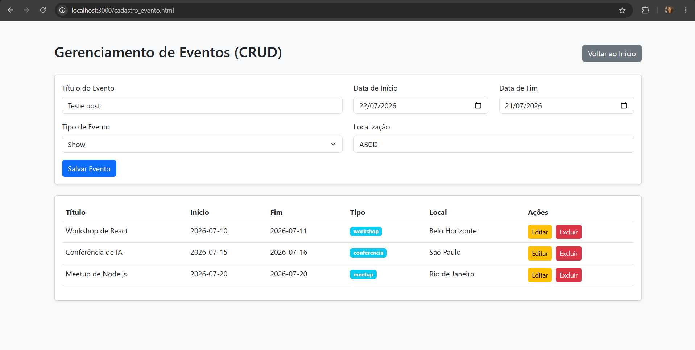
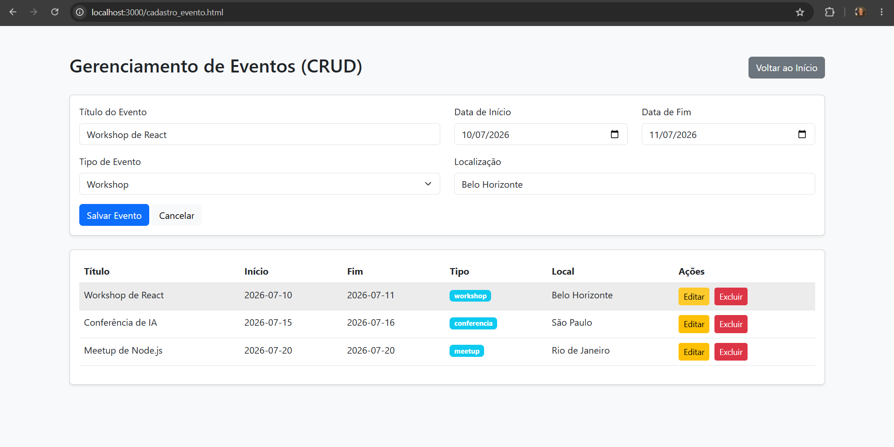
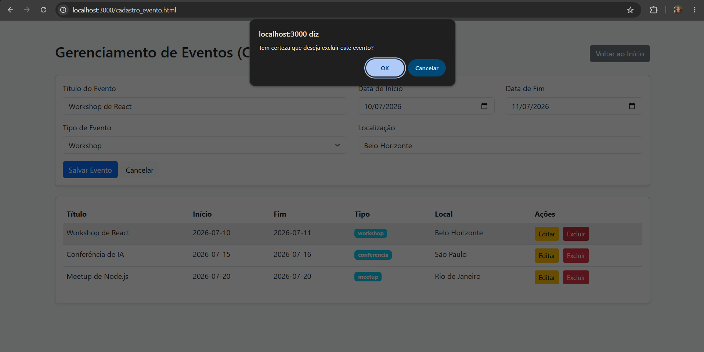
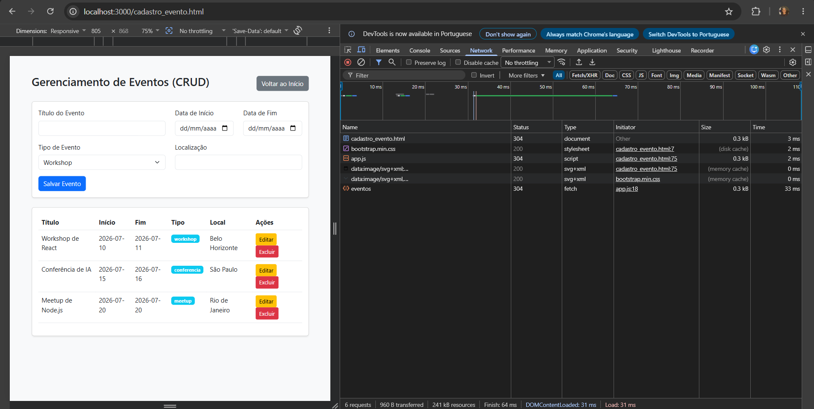

# Trabalho Prático - Semana 16 (CRUD com JSON Server)

A partir dos dados do projeto, fiz a integração com um back-end fake utilizando o JSON-Server, a fim de criar uma aplicação dinâmica que consome uma API RESTful com operações CRUD (Create, Read, Update, Delete) via Fetch API.

## Informações do trabalho

- **Nome**: Frederico Marcos de Paula Marques
- **Matrícula**: 907680
- **Proposta de projeto escolhida**: Eventos (Calendário Interativo)
- **Breve descrição sobre seu projeto**: Uma aplicação onde é possível gerenciar eventos (CRUD - Cadastro de Eventos) salvos localmente utilizando o JSON-Server. A aplicação consome a API RESTful de forma assíncrona, usando a Fetch API para a manipulação dos dados, e reflete as alterações dinamicamente em uma tela de "Apresentação" (detalhes) baseada na biblioteca FullCalendar.

## Prints da Aplicação

### Página Inicial / Cadastro (CRUD)


### Página de Detalhes (Apresentação Dinâmica)


## Estrutura de Dados (db.json)

```json
{
  "eventos": [
    {
      "id": "1",
      "title": "Workshop de React",
      "start": "2026-07-10",
      "end": "2026-07-11",
      "type": "workshop",
      "location": "Belo Horizonte"
    },
    {
      "id": "2",
      "title": "Conferência de IA",
      "start": "2026-07-15",
      "end": "2026-07-16",
      "type": "conferencia",
      "location": "São Paulo"
    },
    {
      "id": "3",
      "title": "Meetup de Node.js",
      "start": "2026-07-20",
      "end": "2026-07-20",
      "type": "meetup",
      "location": "Rio de Janeiro"
    }
  ]
}
```

## Testes da API (JSONServer)

Abaixo seguem os prints dos testes das requisições via cliente REST, englobando as quatro operações fundamentais do protocolo HTTP:

**GET** (Listagem)


**POST** (Criação)


**PUT** (Atualização)


**DELETE** (Remoção)


## Print da aba Network (Requisições Fetch/XHR)

Confirmação das requisições GET e POST feitas a partir do formulário de cadastro, visíveis na aba Network das DevTools:
