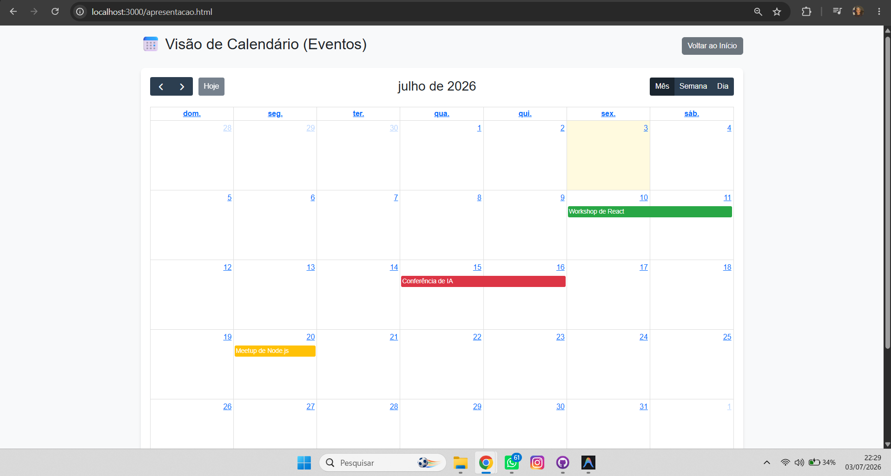
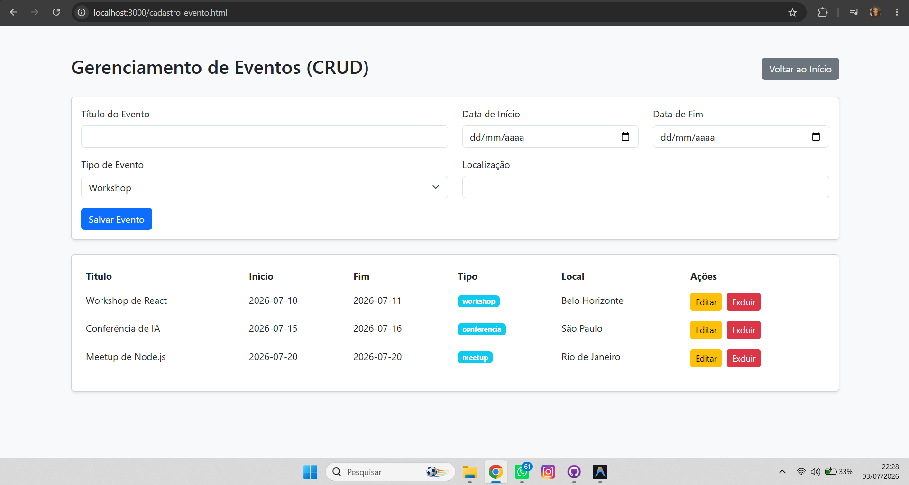

# Trabalho Prático - Semana 14

A partir dos dados que você tem no seu projeto, vamos trabalhar formas de apresentação que representem de forma clara e interativa essas informações. Você poderá usar gráficos (barra, linha, pizza), mapas, calendários ou outras formas de visualização. Seu desafio é entregar uma página Web que organize, processe e exiba os dados de forma compreensível e esteticamente agradável.

Com base nos tipos de projetos escohidos, você deve propor **visualizações que estimulem a interpretação, agrupamento e exibição criativa dos dados**, trabalhando tanto a lógica quanto o design da aplicação.

Sugerimos o uso das seguintes ferramentas acessíveis: [FullCalendar](https://fullcalendar.io/), [Chart.js](https://www.chartjs.org/), [Mapbox](https://docs.mapbox.com/api/), para citar algumas.

## Informações do trabalho

- Nome: Frederico Marcos de Paula Marques
- Matricula: 907680
- Proposta de projeto escolhida: Eventos (Calendário Interativo)
- Breve descrição sobre seu projeto: Uma aplicação onde é possível gerenciar eventos (CRUD - Cadastro de Eventos) que são salvos localmente utilizando o JSON-Server, juntamente de uma tela de "Apresentação" dinâmica. Esta apresentação utiliza a biblioteca **FullCalendar** para renderizar um calendário completo, distribuindo os eventos visualmente de acordo com a data de início e fim e customizando as cores pela categoria do evento.

**Print da tela com a implementação**

Abaixo estão as capturas de tela mostrando a nova funcionalidade de calendário integrada aos dados mockados do JSON-Server:

